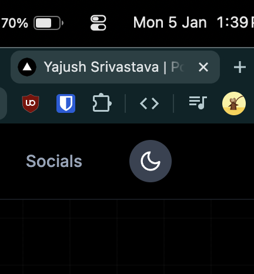
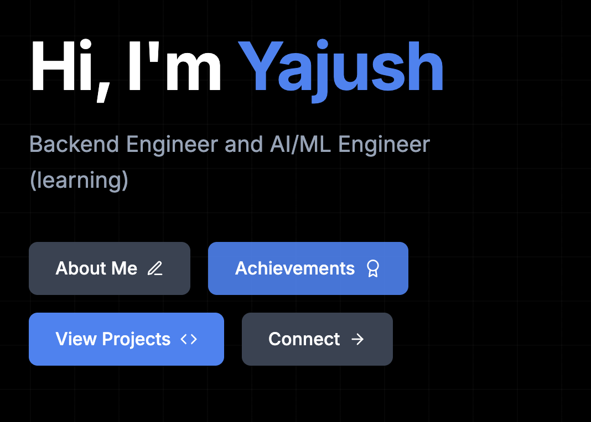
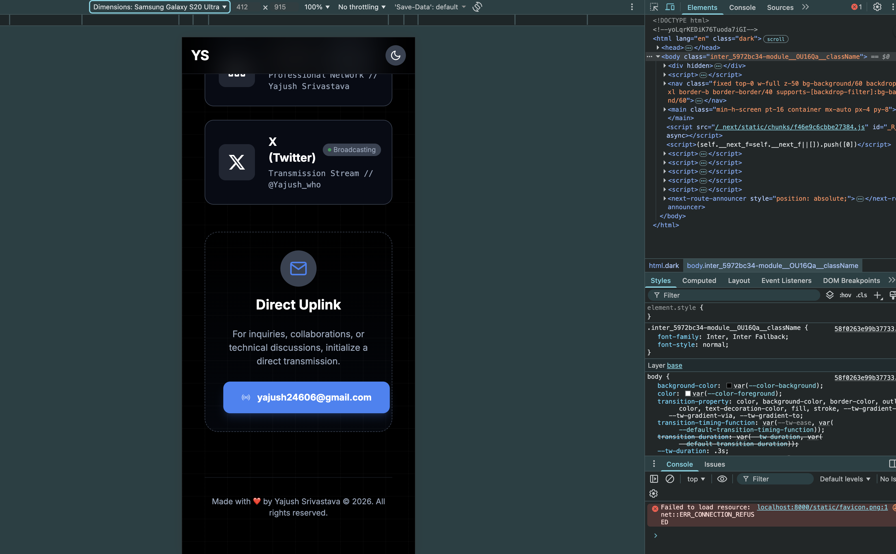

# Portfolio Website Improvement Plan

## The Good

- Good single page portfolio.
- Good navigation response on navbar.
- Good scroll down direction animation.

## The Bad

- Change the favicon of the website. _Suggestion:_ Change it to your own rounded profile picture or your initials. 
- The theme switch button doesn't match the navbar styling, seems to be totally separate. _Suggestion:_ remove the gray background. 
- CTA buttons are not in a symmetric layout. .
- Local time clock can be displayed in a mini-form.
- Lots of ghost space until data animates in. .png>) .png>)
- _Personal Opinion:_ Animation of content on the first visit and scroll is good, but i think animating again after I scroll again, and seeing the content again load is not desirable. I will explain this more in vc.
- Open to work modal can have better tags. _Suggestion:_ Hire me as - Backend Engineer, ML Intern, Researcher. Here is my Resume.
- Spacing between sections is too much needs to be such that user can see that there is a next section below and there was a previous section above.

### Mobile Things

- Contact CTA button has a fixed width, therefore its not responsive, need to look more into it. 

## The Ugly

- First load takes a lot of time. Bad for anyone visiting for potential work. maybe because of the Fullstack implementation. (We don't know how to optimize backend with frontend.) _Suggestion:_ Most of the data is static, a backend is less preferred for static websites like portfolios.
